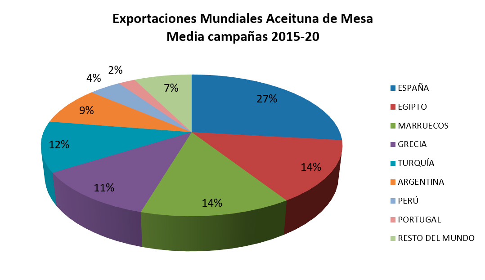

```{r setup, include=FALSE}
knitr::opts_chunk$set(echo = TRUE, out.width = "75%", 
               fig.align = "center")
```

### Procesos y Casos de Innovación y Digitalización y Vigilancia en el Sector Agroalimentario, y Forestal y del Desarrollo Rural

#### Tema: Fundamentos del programa R


## Objetivos

- Analizar un conjunto de datos de la FAO teniendo en cuenta los conceptos estadísticos vistos en clase.
- Aplicar los fundamentos del programa R para el análisis de datos.
- Verificar si existe relación entre área cosechada, producción, rendimiento de aceitunas en España y las exportaciones de aceite de oliva virgen entre los años 1980 y 2020.

## Introducción

España es el primer país productor de aceitunas de mesa del mundo, seguido por Egipto, Turquía, Argelia, Grecia, Siria, Marruecos, Perú y Argentina. La producción media mundial de las últimas cinco campañas asciende a 2.847.700 toneladas, de las cuales 561.100 se produjeron en España, es decir, el 19,7% del total[^1].

[^1]: https://asemesa.es/informacion-general-del-sector/

Según datos del COI (Consejo Oleícola Internacional), el consumo medio de las cinco últimas campañas asciende a 2.814.100 toneladas y se reparten por países según el siguiente gráfico.



## Datos utilizados

Los datos utilizados para el estudio fueron obtenidos de los datos abiertos de la FAO (<http://www.fao.org/faostat/es/#home>) y corresponden al reporte de area cosechada, produccion, rendimiento y exportación de aceite de oliva virgen entre los años 1980 y 2019. 

## Metodología

Para empezar se incluyen las librerias utilizadas para el analisis de los datos:

```{r, message=FALSE}
# Importar las librerias utilizadas
library(tidyverse)
library(cowplot)
library(ggplot2)
library(dplyr)

#Gráficos de correlación
library(PerformanceAnalytics)
```

Seguido a esto, se leen los datos de desde archivos CSV para conformar un dataset con los datos organizados para los procedimientos estadísticos.

```{r, warning=FALSE}
# Lectura de datos a partir de un archivo CSV.
areacosechada_origen <- read.csv("datos/FAOSTAT_data_12-18-2021_area.csv")
rendimiento_origen <- read.csv("datos/FAOSTAT_data_12-18-2021_rendimiento.csv")
produccion_origen <- read.csv("datos/FAOSTAT_data_12-18-2021_produccion.csv")
exportaciones_origen <- read.csv("datos/FAOSTAT_data_12-18-2021_exportaciones.csv")
```

Se realiza la limpieza de los datos para extraer unicamente los necesarios y se descarta el resto de información descargada de la FAO.

```{r, warning=FALSE}
# Extracción de las columnas correspondientes a cada uno de los datos de interés.
areacosechada <- areacosechada_origen[, c(12)]
rendimiento <- rendimiento_origen[, c(12)]
produccion <- produccion_origen[, c(12)]
exportaciones <- exportaciones_origen[, c(12)]

# Lista de años
anios <- produccion_origen[, c(10)]

```

El nuevo dataframe con la información importante para el análisis se puede ver en la siguiente tabla:

```{r, warning=FALSE}
# Convertir en dataframe
olivar <- data.frame(areacosechada, produccion, rendimiento, exportaciones, row.names = anios)

data(olivar)
summary(olivar)
head(olivar, 3)
tail(olivar, 3)
```
Se grafica cada conjunto de datos en diagramas de caja y bigote.

```{r}
# Graficar en dos columnas y dos filas
par(mfrow=c(2, 2))

# boxplot
boxplot(olivar$areacosechada, main="Área cosechada", horizontal = TRUE)
boxplot(olivar$produccion, main="Producción", horizontal = TRUE)
boxplot(olivar$rendimiento, main="Rendimiento", horizontal = TRUE)
boxplot(olivar$exportaciones, main="Exportaciones", horizontal = TRUE)

```

Se observa que existe un dato atípico que posiblemente se deba a un error en los datos de área cosechada, por lo cual se retira del conjunto de datos.

```{r}
# Eliminación de datos atípicos
olivar <- subset(olivar, areacosechada != 1156500)
anios <- anios[2:40]
```


```{r}
#Distribución de densidad
par(mfrow=c(1, 2))
plot(density(olivar$areacosechada), main="Densidad: Área cosechada", ylab="Frecuencia")
plot(density(olivar$exportaciones), main="Densidad: Exportaciones", ylab="Frecuencia")
```

## Gráficas

```{r message=FALSE, echo=FALSE, out.width = "100%"}

p1 <- ggplot(olivar, aes(x = anios, y = areacosechada)) +
  geom_point() +
  stat_smooth()+
  scale_y_continuous(labels = scales::comma) +
  xlab("Año")+
  ylab("Área (ha)") +
  ggtitle("Area cosechada de olivar")

p2 <- ggplot(olivar, aes(x = anios, y = produccion)) +
  geom_point() +
  stat_smooth()+
  scale_y_continuous(labels = scales::comma) +
  xlab("Año")+
  ylab("Toneladas") +
  ggtitle("Producción anual de aceitunas")

p3 <- ggplot(olivar, aes(x = anios, y = rendimiento)) +
  geom_point() +
  stat_smooth()+
  scale_y_continuous(labels = scales::comma) +
  xlab("Año")+
  ylab("Rendimiento (hg/ha)") +
  ggtitle("Rendimiento por hectarea")

p4 <- ggplot(olivar, aes(x = anios, y = exportaciones)) +
  geom_point() +
  stat_smooth() +
  scale_y_continuous(labels = scales::comma) +
  xlab("Año")+
  ylab("Toneladas") +
  ggtitle("Total Exportaciones (Ton)")

plot_grid(p1, p2, p3, p4, nrow = 2, ncol = 2, label_size = 12)

```

## Interpretación de resultados

```{r}
#Gráficos de correlación
chart.Correlation(olivar)
```

```{r}
modelo <- lm(exportaciones~areacosechada+produccion+rendimiento, data = olivar)
summary(modelo)

#ggplot(olivar, aes(x = produccion, y = exportaciones)) +
#  geom_point() +
#  stat_smooth() +
#  scale_y_continuous(labels = scales::comma) +
#  ylab("Exportaciones (Ton)")+
#  xlab("Producción (Ton)") +
#  ggtitle("Correlación Exportaciones - Producción")
```

```{r}
#selección de las mejores variables explicativas
step(modelo,direction = "both")

```

```{r}
modelo <- lm(exportaciones~areacosechada, data = olivar)
summary(modelo)
```

```{r}
#Validación del modelo

#gráficos dispersión cada variable explicativa y los residuos del modelo
#para ver la linealidad entre variables explicativas y variable respuesta
plot(olivar$areacosechada,modelo$residuals)
```

